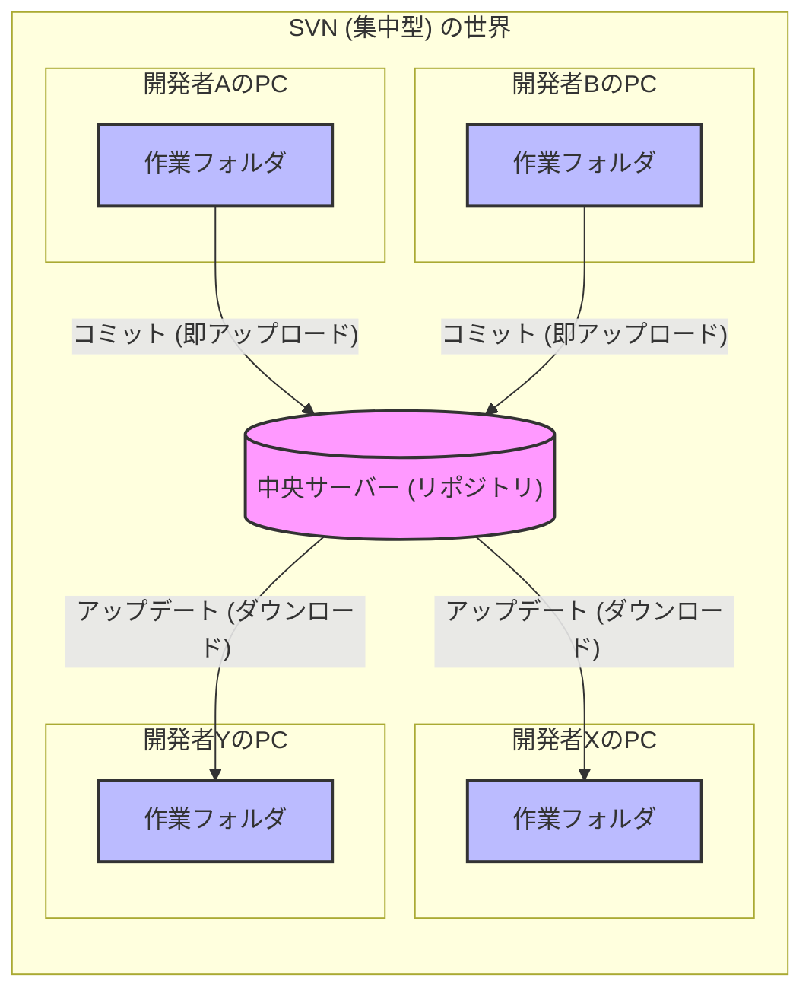
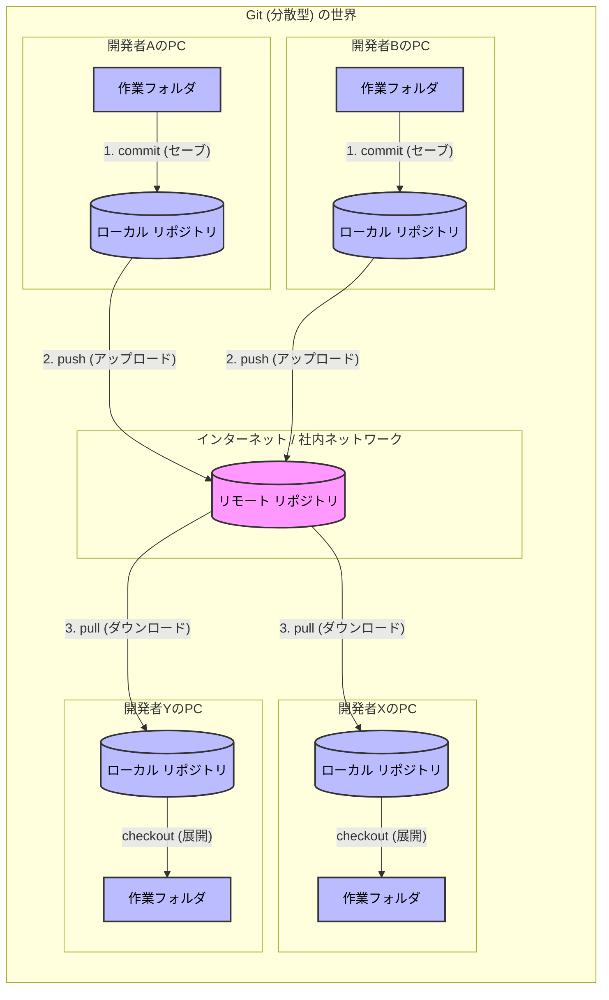

# Gitの歴史と概念：なぜ私たちはGitを使うのか？

## 1. そもそも「ソースコード管理」とは？

皆さんが作成するプログラムのソースコードは、日々変更されていきます。

- 「昨日の状態に戻したい」
- 「いつ、誰が、なぜここを変更したのか知りたい」

と思ったことはありませんか？まだ、ありませんよね？

プログラムを実装しているとそうなるのですが、それを解決するのが **バージョン管理システム（VCS: Version Control System）** です。

単なるバックアップではなく、「変更の歴史」を詳細に記録するツールです。

この VCS で有名なのが Git です。

[Git book](https://git-scm.com/book/ja/v2)

## 2. Git誕生の物語：Linuxカーネル開発の課題

Gitは、世界でも有名なOSである「Linux」の開発現場から生まれました。

出典：[Pro Git: 1.2 Git略史](https://git-scm.com/book/ja/v2/%e4%bd%bf%e3%81%84%e5%a7%8b%e3%82%81%e3%82%8b-Git%e7%95%a5%e5%8f%b2)

### 課題：数千人規模の同時開発

1991年から始まったLinuxの開発には、世界中のハッカーが参加していました。

当初はパッチ（修正差分）をメールで送り合うというアナログな方法や、商用の管理ツール（BitKeeper）を使っていました。

### 事件：ツールの使用禁止

2005年、開発チームとツール提供元の対立により、Linux開発チームはそれまで使っていた管理ツールを無料で使えなくなってしまいました。

### 解決：「気に入らないなら自分で作る」

Linuxの生みの親である **リーナス・トーバルズ (Linus Torvalds)** さんは、既存の他のツール（`Subversion`など）への不満を爆発させました。

> 「既存のツールはどれも遅くて、分散開発に向いていない。僕が考える最強のツールを作る」

彼は**わずか2週間ほど**で新しいツールのプロトタイプを作り上げました。それが **Git** です。

彼が重視したのは以下の点でした。

1. **爆速であること**（数万ファイルの巨大プロジェクトでも一瞬で動く）
2. **分散型であること**（ネットワークが切れていても作業できる）
3. **データが壊れないこと**（過去の履歴を改ざんさせない）

---

## 3. 「集中型」と「分散型」の違い

なぜGitが革新的だったのか、それ以前の主流だった **Subversion (SVN)** と比較してみましょう。

現場によってはまだSVNが現役の場所もあるため、違いを知っておくことは重要です。

### SVN（集中型バージョン管理）

- **特徴:** 中央に一つの「正解（リポジトリ）」がある。
- **弱点:**
  - サーバーと通信できないと、履歴の保存（コミット）ができない。
  - サーバーが故障すると、全員の仕事が止まる。
  - 「全員がサーバー上の同じファイルを触る」感覚に近い。

### Git（分散型バージョン管理）

- **特徴:** 全員が手元（ローカル）に「完全な正解（リポジトリ）」のコピーを持っている。
- **強み:**
  - オフラインでも履歴の保存（コミット）ができる。
  - 自分の手元でいくら実験して壊しても、サーバー（リモート）には影響しない。
  - **「コミット（記録）」と「プッシュ（共有）」が明確に分かれている。**

### アーキテクチャ図解

以下の図を見て、データの流れの違いをイメージしてください。

## この勉強会のゴール

ここでは、Gitを使って以下のことができる状態を目指します。

1. 自分のPC内で安全に履歴の保存を行う (commit)
1. 自分の領域を作って、本番リリース済みの結果を壊さずに機能を試す (branch)
1. チームメンバーと変更を共有・統合する (push / merge)
1. 過去の変更を取り消したり、事故から復旧する (revert / fix)

次は、実際に自分の専用環境（`Codespaces`）で、Gitの初期設定を行っていきましょう。

## 完了したら

[01. 一人で進める開発の基本：セーブデータを記録しよう](/01_local_basic/README.md) へ進みます。
