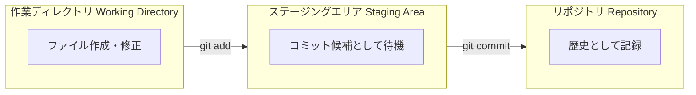
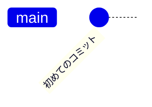
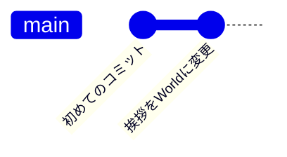

# 01. 一人で進める開発の基本：セーブデータを記録しよう

この章では、自分のPC内（ローカル）だけで、開発の変更履歴を記録する一連の流れを学びます。

まだインターネット（GitHub）には接続しません。まずは「自分のためのバックアップ」を作れるようになりましょう。

## 1. ユーザー情報の登録（誰がやったか？）

Gitは「いつ、**誰が**、何をしたか」を厳格に記録します。そのため、最初に「私は誰か」を設定しないと、コミット（記録）が許可されません。

以下のコマンドをターミナルに入力してください。

※ 実際の開発現場では会社のアドレスなどを使用しますが、ここでは練習用のもので構いません。

```bash
# ユーザー名の設定（ローマ字推奨）
git config --global user.name "Taro Yamada"

# メールアドレスの設定
git config --global user.email "taro@example.com"
```

設定できたか確認してみましょう。

```bash
git config --list
```

一覧の中に、今設定した名前とメールアドレスが表示されていればOKです。

## 2. 練習用エリアの作成 (`git init`)

リポジトリ全体を汚さないように、練習用のフォルダを作って、そこを「Gitで管理する場所」として宣言します。

```bash
# 練習用ディレクトリを作成して移動
mkdir my-practice
cd my-practice

# ここをGit管理下にする（初期化）
git init
```

実行すると `Initialized empty Git repository...` と表示されます。

これで、このフォルダはただのフォルダから **「Gitリポジトリ（記録機能付きフォルダ）」** に進化しました。

**豆知識**: `ls -a` コマンドを打つと、`.git` という隠しフォルダができているのが分かります。

この中に全ての歴史（データベース）が詰まっています。

## 3. 変更・選択・記録のサイクル

Gitへの記録は、RPGなどのゲームのセーブとは少し違います。

**「変更する」**→**「セーブしたいファイルを選ぶ(`add`)」**→**「セーブ実行(`commit`)」** という2段階の手順を踏みます。

### 概念図：3つのエリア



なぜ「add（選択）」が必要なのでしょうか？

それは、**「設定ファイルは変更したけど、まだ書きかけのプログラムはコミットしたくない」** というように、記録する内容を細かく分けたい場合があるからです。

## 4. 実践：最初のコミット

実際にファイルを一つ作って、記録してみましょう。

**STEP 1**: ファイル作成

```bash
echo "Hello Git" > hello.txt
```

**STEP 2**: 状態確認 (`git status`)

今の状態をGitがどう認識しているか確認します。**このコマンドは手癖になるくらい頻繁に使います。**

```bash
git status
```

**結果の見方:**

- `Untracked files`: 「Gitがまだ追跡していない（管理外の）ファイル」として `hello.txt` が赤字などで表示されます。

**STEP 3**: ステージング (`git add`)

このファイルを「次のコミットに含める」として選択します。

```bash
git add hello.txt
```

もう一度 `git status` を確認してください。

- `Changes to be committed`: 表示が緑色などに変わり、「コミットされる準備ができた状態」になりました。

**STEP 4**: コミット (`git commit`)
メッセージを添えて、歴史に確定させます。

```bash
git commit -m "初めてのコミット"
```

- `-m "..."`: コミットメッセージです。何をしたか簡潔に書きます。

## 5. 歴史の確認 (`git log`)

正しく記録されたか、歴史の教科書（ログ）を見てみましょう。

通常の `git log` でも見れますが、以下のコマンドを使うとグラフ形式で見やすくなります。

```bash
git log --oneline --graph --all
```

### 期待される表示

以下のような表示が出ていれば成功です。（英数字の羅列はコミットIDなので、毎回異なります）

```git
* a1b2c3d (HEAD -> main) 初めてのコミット
```



### 実践：2回目のコミット

歴史を積み重ねてみましょう。ファイルを修正して、再度コミットします。

手順

1. ファイルを上書き修正します。

    ```bash
    echo "Hello Git World" > hello.txt
    ```

1. 状態を確認します。（modified になっているはずです）

    ```bash
    git status
    ```

1. 変更をステージングします。

    ```bash
    git add hello.txt
    ```

1. コミットします。

    ```bash
    git commit -m "挨拶をWorldに変更"
    ```

### 確認

もう一度ログを見てみましょう。

```bash
git log --oneline --graph --all
```

丸（コミット）が縦に2つ繋がっていれば大成功です。

HEAD（現在地）が最新のコミットを指しています。



## まとめ

この章では以下のコマンドを覚えました。

| コマンド | 意味 | RPGでの例え |
| -- | -- | -- |
| `git init` | リポジトリ作成 | 新しくリポジトリを作成する |
| `git status` | 状態確認 | ステータスを確認する |
| `git add <file>` | ステージング | セーブしたい項目にチェックを入れる |
| `git commit -m "..."` | 記録実行 | 「セーブしました」 |
| `git log` | 履歴確認 | 冒険の記録を読み返す |

## 完了したら

次は [02. 平行世界を作る：ブランチとマージ](./02_branch_and_merge/README.md) へ進みます。
