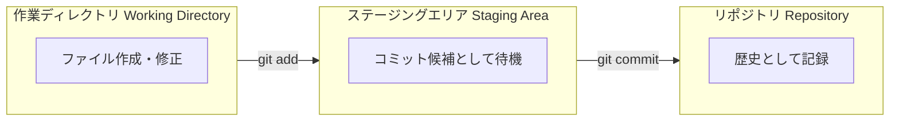
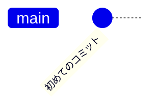
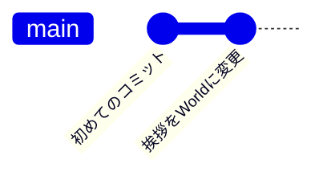

# 01. 一人で進める開発の基本：セーブデータを記録しよう

この章では、自分のPC内（ローカル）だけで、開発の変更履歴を記録する一連の流れを学びます。

まだインターネット（GitHub）には接続しません。まずは「自分のためのバックアップ」を作れるようになりましょう。

**この章で学ぶコマンド:**

- `git init` — リポジトリの初期化
- `git status` — 現在の状態確認
- `git add` / `git restore --staged` — ステージング操作
- `git commit` — 変更の記録
- `git log` / `git show` — 履歴の確認

## 1. ユーザー情報の登録（誰がやったか？）

Gitは「いつ、**誰が**、何をしたか」を厳格に記録します。そのため、最初に「私は誰か」を設定しないと、コミット（記録）が許可されません。

以下のコマンドをターミナルに入力してください。

※ 実際の開発現場では会社のアドレスなどを使用しますが、ここではGitHubのアカウントと同じ物にしてください。

```bash
# ユーザー名の設定（ローマ字推奨）
git config --global user.name "toshi-inoue"

# メールアドレスの設定
git config --global user.email "toshi-inoue@example.co.jp"
```

設定できたか確認してみましょう。

一覧の中に、今設定した名前とメールアドレスが表示されていればOKです。

```bash
git config --list
```

ターミナルの行数より、設定の内容表示数が多い場合、ターミナルの表示は一度止まります。

途中で止まった場合は、コロン（`:`）が最後の行に出てきます。

```bash
git config --list
・
・
・
user.name=toshi-inoue
user.email=toshi-inoue@example.co.jp
・
・
・
:
```

`Enter`キーを押せば続きの行を表示します。

もし終了したい場合は、`Q`キーを押すことで終了することができます。

## 2. 練習用エリアの作成 (`git init`)

リポジトリ全体を汚さないように、練習用のフォルダを作って、そこを「Gitで管理する場所」として宣言します。

> **📁 この演習について:** 以降の手順では `my-practice` というフォルダを作り、その中で Git を学習します。Codespaces の元のリポジトリとは **完全に独立した練習専用の場所** です。安心して試してください。

```bash
# 練習用ディレクトリを作成して移動
mkdir my-practice
cd my-practice

# ここをGit管理下にする（初期化）
git init
```

実行すると `Initialized empty Git repository...` と表示されます。

これで、このフォルダはただのフォルダから **「Gitリポジトリ（記録機能付きフォルダ）」** に進化しました。

**豆知識**: `ls -a` コマンドを打つと、`.git` という隠しフォルダができているのが分かります。

この中に全ての歴史（データベース）が詰まっています。

## 3. 変更・選択・記録のサイクル

Gitへの記録は、RPGなどのゲームのセーブとは少し違います。

**「変更する」**→**「セーブしたいファイルを選ぶ(`add`)」**→**「セーブ実行(`commit`)」** という2段階の手順を踏みます。

### 概念図：3つのエリア


```mermaid
flowchart LR
    subgraph WD [作業ディレクトリ Working Directory]
        File1[ファイル作成・修正]
    end
    
    subgraph Stage [ステージングエリア Staging Area]
        File2[コミット候補として待機]
    end
    
    subgraph Repo [リポジトリ Repository]
        Commit[歴史として記録]
    end
    
    WD -- "git add" --> Stage
    Stage -- "git commit" --> Repo
```

なぜ「add（選択）」が必要なのでしょうか？

それは、**「設定ファイルは変更したけど、まだ書きかけのプログラムはコミットしたくない」** というように、記録する内容を細かく分けたい場合があるからです。

## 4. 実践：最初のコミット

実際にファイルを一つ作って、記録してみましょう。

**STEP 1**: ファイル作成

```bash
echo "Hello Git" > hello.txt
```

**STEP 2**: 状態確認 (`git status`)

今の状態をGitがどう認識しているか確認します。**このコマンドは手癖になるくらい頻繁に使います。**

```bash
git status
```

**結果の見方:**

- `Untracked files`: 「Gitがまだ追跡していない（管理外の）ファイル」として `hello.txt` が赤字などで表示されます。

**STEP 3**: ステージング (`git add`)

このファイルを「次のコミットに含める」として選択します。

```bash
git add hello.txt
```

もう一度 `git status` を確認してください。

- `Changes to be committed`: 表示が緑色などに変わり、「コミットされる準備ができた状態」になりました。

> **💡 間違えて add した場合**
>
> 「あ、このファイルはまだコミットしたくなかった！」という時は、ステージングを取り消せます。
>
> ```bash
> # ステージングを取り消す（ファイルの内容はそのまま）
> git restore --staged hello.txt
> ```
>
> `git status` を確認すると、また `Untracked files` または `Changes not staged` に戻っています。
> `git add` を「変更の保存」だと思うとパニックになりがちですが、コミットする前なら何度でもやり直せます。
>
> 一部だけ取り消したい場合（対話式）は `-p` オプションを追加します。
>
> ```bash
> git restore -p --staged hello.txt
> ```
>
> 変更箇所ごとに「ステージングを取り消す？」と聞かれます。`y`（する）/ `n`（しない）で答えます。

> **💡 変更の一部だけをステージングしたい場合 (`git add -p`)**
>
> 1つのファイルに複数の変更が混在している場合、変更箇所（ハンク）を選んでステージングできます。
>
> ```bash
> git add -p hello.txt
> ```
>
> 各変更箇所ごとに「ステージングする？」と聞かれます。`y`（する）/ `n`（しない）で答えます。
> 「機能追加と typo 修正を別々のコミットにしたい」ときに重宝します。

**STEP 4**: コミット (`git commit`)
メッセージを添えて、歴史に確定させます。

```bash
git commit -m "初めてのコミット"
```

- `-m "..."`: コミットメッセージです。何をしたか簡潔に書きます。

## 5. 歴史の確認 (`git log`)

正しく記録されたか、歴史の教科書（ログ）を見てみましょう。

通常の `git log` でも見れますが、以下のコマンドを使うとグラフ形式で見やすくなります。

```bash
# グラフ形式で全ブランチを一覧表示（最もよく使うログ確認コマンド）
git log --oneline --graph --all

# 直近5件だけ表示したい場合
git log -n 5
```

### 期待される表示

以下のような表示が出ていれば成功です。（英数字の羅列はコミットIDなので、毎回異なります）

```git
* a1b2c3d (HEAD -> main) 初めてのコミット
```


```mermaid
gitGraph
   commit id: "初めてのコミット"
```

### コミットの詳細を見る (`git show`)

`git log` でコミットIDを確認したら、`git show` でそのコミットの**変更内容（差分）**を確認できます。

```bash
# コミットの全変更内容を表示
git show a1b2c3d

# 特定のファイルだけを表示
git show a1b2c3d:hello.txt

# スペースやタブの違いを無視して差分を見る（インデント変更を無視したい時）
git show --ignore-all-space
```

出力には「コミットメッセージ」「変更したファイル」「追加行（`+`）・削除行（`-`）」が表示されます。

「このコミットで具体的に何を変えたのか」を後から確認する時に使います。

### 実践：2回目のコミット

歴史を積み重ねてみましょう。ファイルを修正して、再度コミットします。

手順

1. ファイルを上書き修正します。

    ```bash
    echo "Hello Git World" > hello.txt
    ```

1. 状態を確認します。（modified になっているはずです）

    ```bash
    git status
    ```

1. 変更をステージングします。

    ```bash
    git add hello.txt
    ```

1. コミットします。

    ```bash
    git commit -m "挨拶をWorldに変更"
    ```

### 確認

もう一度ログを見てみましょう。

```bash
git log --oneline --graph --all
```

丸（コミット）が縦に2つ繋がっていれば大成功です。

HEAD（現在地）が最新のコミットを指しています。


```mermaid
gitGraph
   commit id: "初めてのコミット"
   commit id: "挨拶をWorldに変更"
```

## 6. 綺麗なコミットの工夫

コマンドが使えるようになったら、次は「良いコミット」を意識しましょう。

### 綺麗なコミットの基準

> **「10年後の自分（または、別の現場の後輩）が読んで伝わるか？」**

これがコミットの品質を測る一番の基準です。具体的には以下を意識してください。

- **1つのコミットが、1つの意図（理由）だけで構成されている**
  - 「ログイン機能の追加」と「typo修正」を1つのコミットに混ぜない
- **コミットメッセージに変更の「理由」を書く**
  - `修正` ← 悪い例（何を修正したのかわからない）
  - `ログイン機能: ユーザー認証ロジックを追加` ← 良い例（何を・なぜ変えたかが伝わる）
- **同じ箇所を何度も書き換えていないか確認する**
  - 「修正」「また修正」「さらに修正」と続くなら、`rebase -i` でまとめる（[04章](../04_fix_and_recovery/README.md#6-コミットをきれいに整えるgit-rebase--i)参照）

### 直前のコミットをすぐ直す (`git commit --amend`)

コミット直後に「あ、メッセージを間違えた！」「ファイルを追加し忘れた！」という場合は `--amend` で上書きできます。

```bash
# コミットメッセージだけ直す
git commit --amend -m "正しいメッセージ"

# ファイルを追加し忘れた場合（メッセージはそのまま）
git add 忘れたファイル.py
git commit --amend --no-edit
```

> ⚠️ **`--amend` は Push 前限定です。** Push 後のコミットに使うと、チームの歴史と整合性が取れなくなります。詳しくは [04章](../04_fix_and_recovery/README.md) で扱います。

---

## まとめ

この章では以下のコマンドを覚えました。

| コマンド | 意味 | RPGでの例え |
| -- | -- | -- |
| `git init` | リポジトリ作成 | 新しくリポジトリを作成する |
| `git status` | 状態確認 | ステータスを確認する |
| `git add <file>` | ステージング | セーブしたい項目にチェックを入れる |
| `git add -p <file>` | 対話式ステージング | 変更箇所を1つずつ選んでチェックを入れる |
| `git restore --staged <file>` | ステージング取消 | チェックを外す（ファイルは変更済みのまま） |
| `git commit -m "..."` | 記録実行 | 「セーブしました」 |
| `git commit --amend` | 直前のコミットを修正 | 直前のセーブを上書きする |
| `git log --oneline --graph --all` | 履歴確認（グラフ） | 冒険の記録を地図付きで読み返す |
| `git log -n 5` | 直近N件の履歴確認 | 最近の冒険だけ読み返す |
| `git show <コミットID>` | コミット詳細確認 | そのセーブポイントで何が変わったか見る |

## 次のステップ

次は [02. 平行世界を作る：ブランチとマージ](../02_branch_and_merge/README.md) へ進みます。

---

| [← 第00章: Gitの歴史と概念](../00_history_and_concept/README.md) | [全章目次](../README.md) | [第02章: 平行世界を作る →](../02_branch_and_merge/README.md) |
|:---|:---:|---:|
