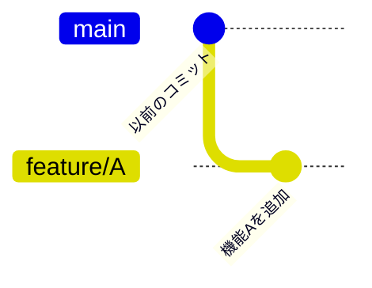
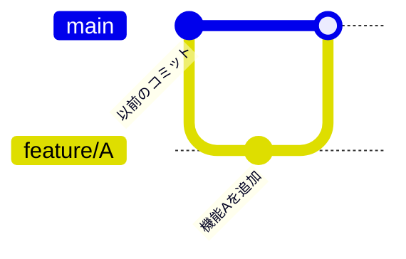
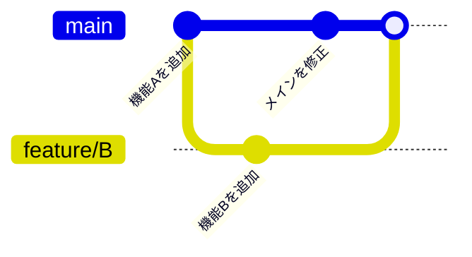

# 02. 平行世界を作る：ブランチとマージ

開発現場では、「本番用のコード」を維持したまま、「新機能の実験」や「バグ修正」を同時に進める必要があります。

これを実現するのが **ブランチ（Branch）** です。

ブランチを使うと、リポジトリの中に「平行世界」を作り出し、互いに影響を与えずに作業を進めることができます。

## 1. ブランチとは？

これまでは「一本道」で開発してきました。

ブランチを切る（作成する）と、そこから歴史が分岐します。

- **main (master):** 本番用の世界（安定版）
- **feature/xxx:** 機能追加用の実験世界
- **fix/xxx:** 修正用の作業世界

### 重要な概念：HEAD（ヘッド）

Gitには **HEAD** という概念があります。

これは**「今、自分がどの世界（ブランチ）の、どの時点（コミット）にいるか」**を示すポインタです。

「現在地マーク」だと思ってください。

---

## 2. 実践：新しい世界を作る (`checkout -b`)

前章の続きから始めます。

まずは現在の状態を確認しましょう。

```bash
git log --oneline --graph --all
```

`HEAD -> main` となっていれば、「今、mainブランチにいる」ということです。

では、新しい機能を開発するためのブランチ feature/A を作成して、同時にそこへ移動してみましょう。

```bash
# -b オプションは「作成して移動する」という意味
git checkout -b feature/A
```

※ `Switched to a new branch 'feature/A'` と表示されれば成功です。

確認してみましょう。

```bash
git log --oneline --graph --all
```

`HEAD -> feature/A, main` という表示になり、`HEADが feature/A` を指していることがわかります。

## 3. 実践：平行世界での変更

ここでの変更は、元の世界（`main`）には影響しません。実験してみましょう。

### 変更手順

1. 新しいファイルを作成してコミットします。

    ```bash
    echo "新機能Aです" > feature.txt
    git add feature.txt
    git commit -m "機能Aを追加"
    ```

1. 履歴を確認します。

    ```bash
    git log --oneline --graph --all
    ```

mainよりも一歩先に進んでいるはずです。



## 4. 実践：世界の切り替え (`checkout`)

ここがGitの面白いところです。元の世界（`main`）に戻ってみましょう。

```bash
# mainブランチに戻る
git checkout main
```

フォルダの中身を確認してください！

さっき作ったはずの feature.txt が消えているはずです。
（ls コマンドなどで確認できます）

これは消滅したわけではなく、 **「mainブランチの世界には、まだ機能Aが存在しないから」** です。

Gitは、ブランチを切り替えるたびに、フォルダの中身をその時点の状態に瞬間的に書き換えます。

もう一度 `feature/A` に戻れば、ファイルは復活します。

```bash
git checkout feature/A
ls
# feature.txt がある！
```

## 5. 統合：マージ (`merge`)

実験（機能Aの開発）が成功したので、これを本番（`main`）に取り込みます。この作業を マージ（Merge） と言います。

### merge 手順

1. 取り込む側（`main`） に移動します。ここ重要です。「吸収する側」に移動してから「吸収したい相手」を指定します。

    ```bash
    git checkout main
    ```

1. マージを実行します。

    ```bash
    git merge feature/A
    ```

#### 結果確認

`Fast-forward` と表示されたはずです。これは「枝分かれしたけど、`main`側には何も変更がなかったので、単純に追いついただけ」という最も平和なマージです。

```bash
git log --oneline --graph --all
```

`main`ラベルが最新のコミットに追いつき、`feature/A`と同じ場所に来ました。



## 6. 実践：枝分かれする歴史（ノンファストフォワード）

次は、もう少し複雑な、**「開発中に、本番側も誰か（あるいは自分）がいじって進んでしまった」** ケースを再現します。

### ノンファストフォワード手順

**STEP 1**: `feature/B` で開発を進める

1. ブランチ作成・移動

    ```bash
    git checkout -b feature/B
    ```

1. 変更・コミット

    ```bash
    echo "機能Bを作成" > feature_b.txt
    git add feature_b.txt
    git commit -m "機能Bを追加"
    ```

**STEP 2**: main に戻って別の変更をする

1. mainに戻る

    ```bash
    git checkout main
    ```

1. 別の変更をしてコミット（feature/Bとは別の道を進む）

    ```bash
    echo "メイン側の急ぎの修正" > hotfix.txt
    git add hotfix.txt
    git commit -m "メインを修正"
    ```

    この時点での確認:

    ```bash
    git log --oneline --graph --all
    ```

    Y字型に歴史が分岐しているのが見えるはずです！

**STEP 3**: マージする

分岐した歴史を一つにまとめます。

```bash
# 今 main にいることを確認して...
git merge feature/B
```

今度は、エディタ（VimやNano）が立ち上がり、コミットメッセージの入力を求められます。

これは、合流地点を作るための特別なコミット（マージコミット）が作られるからです。

そのまま保存して終了してください。（Vimなら `:wq Enter`）

※ 実際の現場では `main` や `develop` を変更することはありません。もし、変更してしまった場合は、直ちに周りの人に相談しましょう。

#### 最終確認

```bash
git log --oneline --graph --all
```

二つの道が分かれ、最後に合流している形になっていれば成功です。



## コラム： モダンなGitコマンド：switch と restore

Git 2.23 (2019年) から、役割が多すぎた checkout コマンドを整理するために、新しいコマンドが導入されました。 新しい現場ではこちらが標準になっていることもあります。

### なぜ分かれたの？

`checkout` は「ブランチの切り替え」と「ファイルの復元（取り消し）」という、全く違う2つの機能を持っていました。これが混乱の元でした。

**ブランチ操作**：`git switch`

「切り替える」ことに特化したコマンドです。

| 動作 | 従来のコマンド | 新コマンド |
| -- | -- | -- |
| ブランチを切り替える | `git checkout main` | `git switch main` |
| 作成して切り替える| `git checkout -b feature` | `git switch -c feature` |

**ファイル復元**：`git restore`

「変更を取り消す（元に戻す）」ことに特化したコマンドです。

| 動作 | 従来のコマンド | 新コマンド |
| -- | -- | -- |
| 編集中のファイルを取り消す | `git checkout -- file.txt` | `git restore file.txt` |
| ステージングを取り消す | `git reset HEAD file.txt` | `git restore --staged file.txt` |

**アドバイス**: 古いサーバー（`CentOS 7`など）では新しいコマンドが使えないことがあります。 そのため、基本は `checkout` を覚え、自分の環境が許すなら `switch` を使う という考え方が最適です。

## 次のステップ

次は [03. チーム開発のルール：ワークフローとリモート連携](/03_workflows/README.md) へ進みます。
