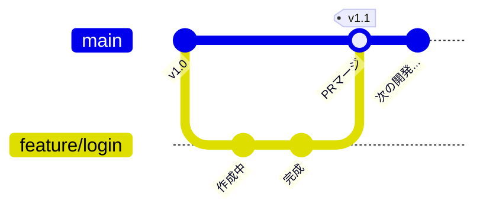
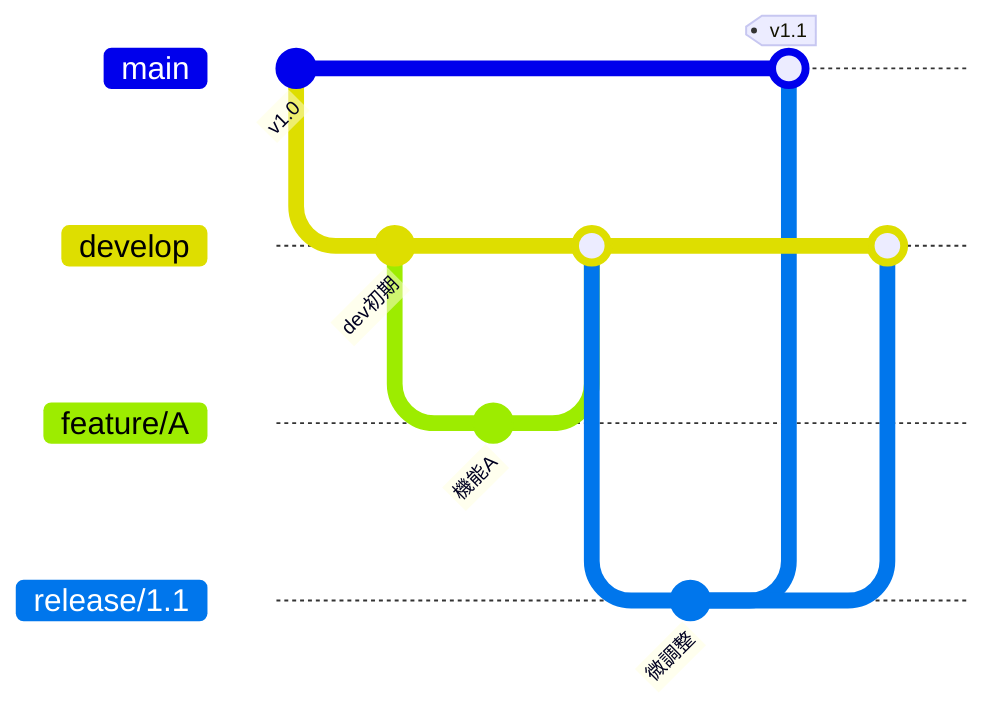

# 03. チーム開発のルール：ワークフローとリモート連携

自分のPC（ローカル）での操作は完璧ですね。

ここからは、インターネット上のサーバー（リモートリポジトリ）を使って、チームで開発を進める方法を学びます。

## 1. リモートとの連携コマンド

チーム開発では、自分の変更をアップロードしたり、人の変更をダウンロードしたりします。

### 1-1. リモートの登録 (`git remote`)

「このリポジトリのアップロード先」を登録します。

慣習として **`origin`** という名前を使います。

別の名前でもOKです。わかりやすい名称にします。

```bash
# 書式: git remote add <名前> <URL>
git remote add origin https://github.com/t-inoue0214/starter-git-and-github.git
```

### 1-2. アップロード (`git push`)

自分の歴史をリモートに送信します。

```bash
# 初回のみ -u オプション（流す先を固定する）をつける
git push -u origin main
```

### 1-3. ダウンロード (`git pull`)

リモートにある最新の変更を、手元に取り込みます。 **朝、仕事を開始する時は必ずこれを叩くのがマナーです**。

```bash
git pull origin main
```

## 2. 現場で使われる2つの「型」（ワークフロー）

Gitの使い方は自由ですが、チームで無法地帯にならないよう、いくつかの「型」が存在します。

SESとして現場に入場した際、「御社のGitフローはどうなっていますか？」と確認できるようになりましょう。

### パターンA：GitHub Flow（GitHubフロー）

Webサービスやスタートアップ企業で主流の、シンプルでスピード重視のフローです。

- 特徴: `main` ブランチと `feature` ブランチしか使いません。
- ルール:
  - `main` は常にデプロイ（リリース）可能な状態にする。
  - 新機能は `main` からブランチを切って作る。
  - 完成したら **プルリクエスト (Pull Request / PR)** を送る。
  - レビューOKなら `main` にマージして、即リリース。



### パターンB：Git Flow（Gitフロー）

SIerやパッケージ開発、大規模システムで使われる、厳格で安全重視のフローです。

- 特徴: 役割の違うブランチがたくさんあります。
  - `main` (または `master`): 本番環境用。絶対に壊してはいけない。
  - `develop`: 開発用。みんなの変更はここに集まる。
  - `release`: リリース直前のテスト用。
  - `feature`: 個人の作業用。
- ルール: 開発者は develop からブランチを切り、`develop` に戻します。



## 3. プルリクエスト (Pull Request) とは？

GitHub（やGitLab, Bitbucket）特有の機能で、**「私の変更を取り込んでください！」とお願いする機能**です。 Gitのコマンドではなく、ブラウザ上で操作します。

1. `git push` で自分のブランチをアップロードする。
1. GitHubの画面で「Pull Request」ボタンを押す。
1. リーダーや同僚がコードをレビュー（チェック）する。
1. 問題なければ `Merge` ボタンが押され、統合される。

## 4. プルリクエストのレビュー対応

GitHubでPull Request (PR) を出した後、レビュアー（先輩）から修正依頼が来ることがあります。

- Q. PRを閉じて、もう一度作り直す必要がありますか？
- A. いいえ、その必要はありません！

### 修正の流れ

1. ローカルで修正する: 自分のPCで、指摘された箇所を直します。
2. コミットする: `git add`, `git commit` します。
3. Pushする: `git push origin <ブランチ名>` します。 **自動的にGitHub上のPRに変更が反映されます。**

これだけで、GitHub上のPRが自動的に更新され、新しいコミットが追加されます。

## まとめ

- `Remote`: `origin` はクラウド上の保管場所
- `Push` / `Pull`: アップロードとダウンロード的な動き
- `Workflow`:
  - `GitHub Flow`: シンプルなフロー
  - `Git Flow`: 複雑ではあるがさまざまな変更に対応したフロー

## 次のステップ

次は [04. 失敗と修正：リカバリの作法と禁忌](/04_fix_and_recovery/README.md) へ進みます。
