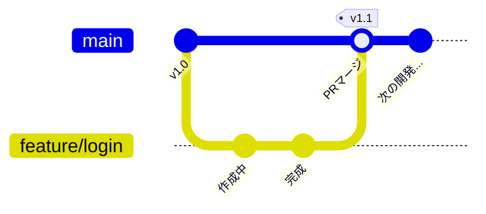
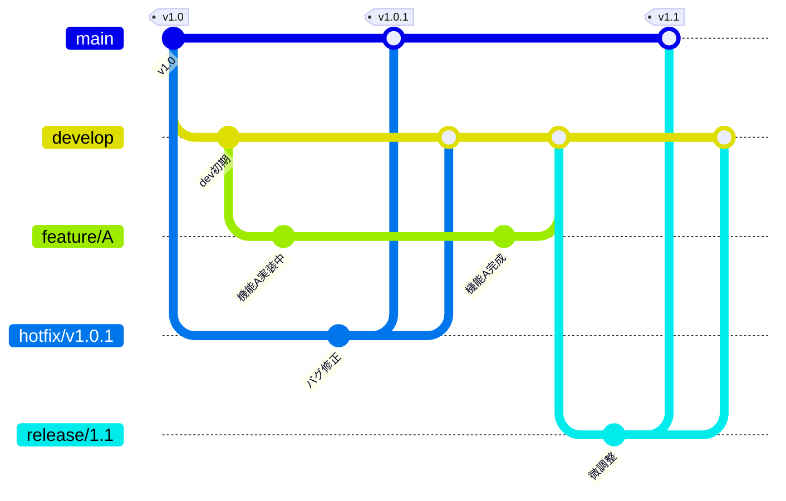
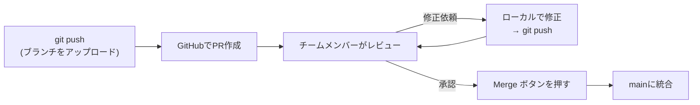

# 03. チーム開発のルール：ワークフローとリモート連携

自分のPC（ローカル）での操作は完璧ですね。

ここからは、インターネット上のサーバー（リモートリポジトリ）を使って、チームで開発を進める方法を学びます。

**この章で学ぶコマンド:**

- `git remote add` — リモートリポジトリの登録
- `git push` — ローカルの変更をリモートへアップロード
- `git fetch` — リモートの変更情報を取得（手元には反映しない）
- `git pull` — リモートの変更を取得してマージ（fetch + merge）

## 1. リモートとの連携コマンド

チーム開発では、自分の変更をアップロードしたり、人の変更をダウンロードしたりします。

### 1-1. リモートの登録 (`git remote`)

「このリポジトリのアップロード先」を登録します。

慣習として **`origin`** という名前を使います。

別の名前でもOKです。わかりやすい名称にします。

```bash
# 書式: git remote add <名前> <URL>
git remote add origin https://github.com/あなたのアカウント名/リポジトリ名.git
```

### 1-2. アップロード (`git push`)

自分の歴史をリモートに送信します。

```bash
# 初回のみ -u オプション（流す先を固定する）をつける
git push -u origin main
```

### 1-3. 安全なダウンロード：fetch → 確認 → merge

リモートの変更を手元に取り込む方法は2段階あります。

#### `git fetch`（取り込み確認だけ）

リモートの最新情報を取得しますが、**手元のブランチには反映しません**。「何が変わったか確認してから取り込みたい」時に使います。

```bash
# リモートの最新情報を取得
git fetch origin

# リモートの main と自分の main を比較する
# HEAD = 自分の現在地、origin/main = リモートの最新状態
git log HEAD..origin/main --oneline
# （何も表示されなければ差分なし）

# 差分の概要をファイル単位で確認
git diff --stat origin/main
```

#### `git pull`（取得 + マージを一度に）

fetch + merge を一度にまとめて実行します。**朝、仕事を開始する時は必ずこれを叩くのがマナーです**。

```bash
git pull origin main
```

#### fetch vs pull の使い分け

| 状況 | 推奨 |
| :--- | :--- |
| 朝の最初の取り込み（差分が予想範囲内） | `git pull` |
| 「他の人が何を push したか」確認してから取り込みたい | `git fetch` → `git diff` → `git merge` |
| コンフリクトが起きそうで事前に確認したい | `git fetch` → `git diff` → `git merge` |

> **💡 慣れてきたら fetch を使う習慣を** つけましょう。pull は安全ですが、fetch で「何が来るか」を確認してからマージするのが本番環境での丁寧なやり方です。

## 2. 現場で使われる2つの「型」（ワークフロー）

Gitの使い方は自由ですが、チームで無法地帯にならないよう、いくつかの「型」が存在します。

SESとして現場に入場した際、「御社のGitフローはどうなっていますか？」と確認できるようになりましょう。

### パターンA：GitHub Flow（GitHubフロー）

Webサービスやスタートアップ企業で主流の、シンプルでスピード重視のフローです。

- 特徴: `main` ブランチと `feature` ブランチしか使いません。
- ルール:
  - `main` は常にデプロイ（リリース）可能な状態にする。
  - 新機能は `main` からブランチを切って作る。
  - 完成したら **プルリクエスト (Pull Request / PR)** を送る。
  - レビューOKなら `main` にマージして、即リリース。


```mermaid
gitGraph
   commit id: "v1.0"
   branch feature/login
   checkout feature/login
   commit id: "作成中"
   commit id: "完成"
   checkout main
   merge feature/login id: "PRマージ" tag: "v1.1"
   commit id: "次の開発..."
```

### パターンB：Git Flow（Gitフロー）

SIerやパッケージ開発、大規模システムで使われる、厳格で安全重視のフローです。

- **特徴:** 役割の違うブランチがたくさんあります。
  - `main` (または `master`): 本番環境用。絶対に壊してはいけない。
  - `develop`: 開発用。みんなの変更はここに集まる。
  - `release`: リリース直前のテスト用。
  - `hotfix`: **本番環境の緊急バグ修正用。**
  - `feature`: 個人の作業用。

- **ルール:**
  - 通常開発: `develop` から切り、`develop` に戻す。
  - **緊急対応 (`hotfix`):** `main` から切り、**`main` と `develop` の両方に戻す。**（これを忘れると、次のリリースでバグが復活します！）


```mermaid
gitGraph
   commit id: "v1.0" tag: "v1.0"
   branch develop
   checkout develop
   commit id: "dev初期"
   
   branch feature/A
   checkout feature/A
   commit id: "機能A実装中"
   
   %% ここで緊急トラブル発生！
   checkout main
   branch hotfix/v1.0.1
   commit id: "バグ修正"
   checkout main
   merge hotfix/v1.0.1 tag: "v1.0.1"
   
   %% 修正をdevelopにも反映させる（重要）
   checkout develop
   merge hotfix/v1.0.1
   
   %% 通常開発に戻る
   checkout feature/A
   commit id: "機能A完成"
   checkout develop
   merge feature/A
   
   %% リリース作業
   branch release/1.1
   checkout release/1.1
   commit id: "微調整"
   
   checkout main
   merge release/1.1 tag: "v1.1"
   
   checkout develop
   merge release/1.1
```

## 3. プルリクエスト (Pull Request) とは？

GitHub（やGitLab, Bitbucket）特有の機能で、**「私の変更を取り込んでください！」とお願いする機能**です。 Gitのコマンドではなく、ブラウザ上で操作します。

1. `git push` で自分のブランチをアップロードする。
1. GitHubの画面で「Pull Request」ボタンを押す。
1. リーダーや同僚がコードをレビュー（チェック）する。
1. 問題なければ `Merge` ボタンが押され、統合される。


```mermaid
flowchart LR
    A["git push\n(ブランチをアップロード)"] --> B["GitHubでPR作成"]
    B --> C["チームメンバーがレビュー"]
    C -- "修正依頼" --> D["ローカルで修正\n→ git push"]
    D --> C
    C -- "承認" --> E["Merge ボタンを押す"]
    E --> F["mainに統合"]
```

## 4. プルリクエストのレビュー対応

GitHubでPull Request (PR) を出した後、レビュアー（先輩）から修正依頼が来ることがあります。

- Q. PRを閉じて、もう一度作り直す必要がありますか？
- A. いいえ、その必要はありません！

### 修正の流れ

1. ローカルで修正する: 自分のPCで、指摘された箇所を直します。
2. コミットする: `git add`, `git commit` します。
3. Pushする: `git push origin <ブランチ名>` します。 **自動的にGitHub上のPRに変更が反映されます。**

これだけで、GitHub上のPRが自動的に更新され、新しいコミットが追加されます。

## まとめ

この章では以下のコマンドと概念を覚えました。

| コマンド / 概念 | 意味 | RPGでの例え |
| -- | -- | -- |
| `git remote add origin <URL>` | リモートの登録 | セーブデータのバックアップ先を設定する |
| `git push -u origin main` | リモートへアップロード | バックアップサーバーにセーブデータを送る |
| `git fetch origin` | リモート情報の取得（反映はしない） | 「更新データがあるか」だけ確認する |
| `git pull origin main` | リモートの変更を取得してマージ | バックアップからデータを取り込む |
| GitHub Flow | main + feature のシンプルなフロー | 少人数・高速リリース向けの戦略 |
| Git Flow | 複数ブランチを使う厳格なフロー | 大規模・定期リリース向けの戦略 |
| Pull Request | マージ前のレビュー依頼 | 仲間にプレイ内容を確認してもらう |

## 次のステップ

次は [04. 失敗と修正：リカバリの作法と禁忌](../04_fix_and_recovery/README.md) へ進みます。

---

| [← 第02章: 平行世界を作る](../02_branch_and_merge/README.md) | [全章目次](../README.md) | [第04章: 失敗と修正 →](../04_fix_and_recovery/README.md) |
|:---|:---:|---:|
