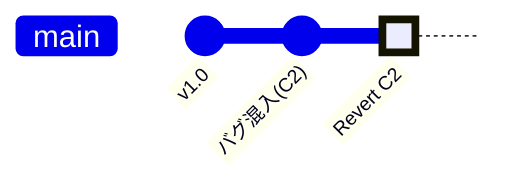
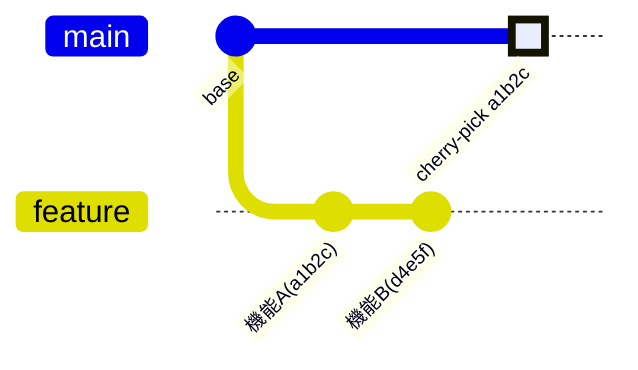

# 04. 失敗と修正：リカバリの作法と禁忌

「コミットメッセージを間違えた！」「マージしたら変な記号がいっぱい出た！」「やっぱりこの変更はなかったことにしたい！」

開発に失敗はつきものです。

Gitには、そんな時のための「修正コマンド」が用意されています。

ただし、**「やっていい修正」と「やってはいけない修正」** があります。

その境界線は **「Pushしたかどうか」** です。

---

## 1. コンフリクト（衝突）の解消

チーム開発で最も頻繁に起きるトラブルです。

「AさんがファイルXの1行目を修正」し、「BさんもファイルXの1行目を修正」して、両者がマージしようとすると発生します。

### 発生時の表示

`git merge` をした時に `CONFLICT` と表示され、自動マージが停止します。

### 直し方

衝突しているファイルを開くと、Gitが以下のような記号を埋め込んでいます。

```text
<<<<<<< HEAD
ここは自分の変更内容
=======
ここは相手（マージしようとしたブランチ）の変更内容
>>>>>>> feature/B
```

1. 手動で修正: エディタで `<<<<` `====` `>>>>` の行を消し、正しいコードに書き直して保存します。
1. 解決を通知:

    ```bash
    git add <修正したファイル名>
    git commit -m "コンフリクト解消"
    ```

これでマージが完了します。怖がる必要はありません。

「Gitが勝手に決められないから、人間が決めてね」と言っているだけです。

### 2. 安全な取り消し：git revert （Push後推奨）

すでにリモート（GitHub等）に push してしまったコミットを取り消したい場合に使います。

歴史を「消す」のではなく、「打ち消す（逆の）コミット」を新しく作って上書きします。

#### revertのシチュエーション

- 「昨日のリリースでバグが見つかった！とりあえず前のバージョンに戻したい！」
- 「誤って`main`(または`develop`)にコミットしちゃった！戻したい！」

#### revertのコマンド

```bash
# 指定したコミットIDの内容を打ち消すコミットを作成する
git revert <コミットID>
```

コミット C2 (バグ) のあとに、C2' (C2を打ち消す変更) が作られます。**歴史は前に進み続けます**。



### 3. 直前の修正：git commit --amend （Push前限定）

「さっきコミットしたけど、メッセージでタイプミスした！」あるいは「ファイルを追加し忘れた！」という時に使います。**直前のコミットを上書き修正**します。

#### amendのシチュエーション

- 「『機能追加』と書くつもりが『機能追加あ』でコミットしてしまった。恥ずかしいから直したい（まだPushしてない）。」

#### amendのコマンド

```bash
git commit --amend -m "機能追加（修正済み）"
```

#### amendの注意点

これは「歴史の改変」です。もしすでに push 済みのコミットに対してこれを行うと、チーム全員の歴史と整合性が取れなくなり、大惨事になります。

一応「Push前ならOK」と覚えてください。

### 4. いいとこ取り：git cherry-pick

別のブランチにある「特定のコミットだけ」を自分のブランチにコピーしてきたい場合に使います。

#### cherry-pickのシチュエーション

- プロダクトオーナー「機能Aと機能Bを作ってもらったけど、今回のリリースには機能Aだけ入れて！機能Bはまだバグがあるから除外して！」

#### cherry-pickのコマンド

機能AのコミットIDを探して（`git log`）、以下を実行します。

```bash
git cherry-pick <機能AのコミットID>
```

featureブランチから、必要な「つまみ食い」だけを`main`に持ってくることができます。



### 5. 【取扱注意】 禁断の果実：git reset と push -f

ここから先は、取り扱いを間違えるとチーム全員の作業を破壊する可能性があります。

**時間を巻き戻す**：`git reset`

指定した過去の地点まで、歴史を強制的に巻き戻します。その間のコミットは消滅します。

```bash
# 2つ前のコミットまで完全に巻き戻す（変更内容も破棄）
git reset --hard HEAD~2
```

**強制上書き**：`git push -f` (Force Push)

ローカルで歴史を改変（amend, reset, rebase）した場合、リモートと歴史が食い違うため、通常の push は拒否されます。これを無理やりねじ込むのが -f オプションです。

```bash
# 絶対に、何をやっているか理解していない限り打ってはいけません
git push -f origin main
```

**なぜ危険なのか？**

もしあなたが `main` ブランチに対して `push -f` を行うと、その間に他のメンバーが `push` していたコミットが全て消え去ります。

「同僚の1週間分の仕事が一瞬で消える」という事故は、これで起こります。

**ルール**:

- ただでさえ、コミット自体をミスすることがあるのに、この操作をする際だけミスが無いという現象にはなりません。絶対にしないでください。
- 自分だけの勉強用リポジトリだけOKと覚えください。

## まとめ

| 状況| Push済み？| 推奨コマンド |
| -- | -- | -- |
| コミットメッセージ直したい | No | `commit --amend` |
| 作業をなかったことにしたい | No | `reset --hard` |
| マージしたら衝突した.     | - | ファイル手修正 -> `add` -> `commit` |
| 特定の機能だけ取り込みたい | - | `cherry-pick` |
| Pushした内容を取り消したい | Yes | `revert` (一番安全) |
| 歴史を書き換えてPushしたい | Yes | 絶対ダメ (または要相談) |

## 次のステップ

次は [05. 現場で役立つ便利機能：Stash, Ignore, Tag](/05_useful_tips/README.md) へ進みます。
