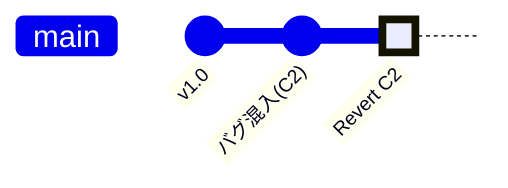
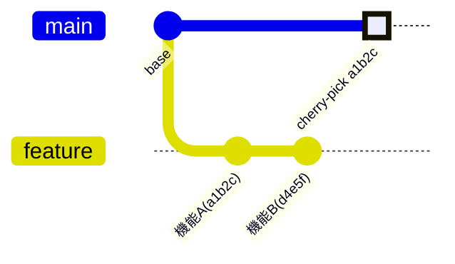
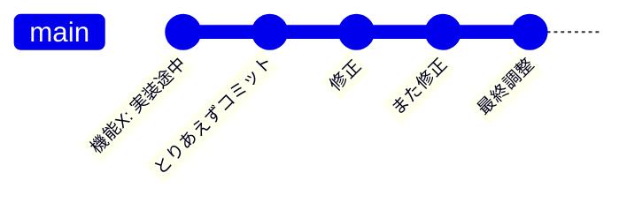
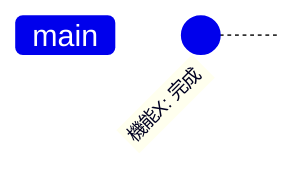

# 04. 失敗と修正：リカバリの作法と禁忌

「コミットメッセージを間違えた！」「マージしたら変な記号がいっぱい出た！」「やっぱりこの変更はなかったことにしたい！」

開発に失敗はつきものです。

Gitには、そんな時のための「修正コマンド」が用意されています。

ただし、**「やっていい修正」と「やってはいけない修正」** があります。

その境界線は **「Pushしたかどうか」** です。

---

**この章で学ぶコマンド:**

- `git revert` — Push後のコミットを安全に取り消す
- `git commit --amend` — 直前のコミットを修正する（Push前限定）
- `git cherry-pick` — 別ブランチの特定コミットだけを取り込む
- `git restore` — 作業ディレクトリの変更を破棄する（Push前限定）
- `git reset` — コミット履歴を巻き戻す（Push前限定）
- `git rebase -i` — コミット履歴を整理・まとめる（Push前限定）
- `git reflog` — 消えたコミットを救出する

## 1. コンフリクト（衝突）の解消

チーム開発で最も頻繁に起きるトラブルです。

「AさんがファイルXの1行目を修正」し、「BさんもファイルXの1行目を修正」して、両者がマージしようとすると発生します。

### 発生時の表示

`git merge` をした時に `CONFLICT` と表示され、自動マージが停止します。

### 直し方

衝突しているファイルを開くと、Gitが以下のような記号を埋め込んでいます。

```text
<<<<<<< HEAD
ここは自分の変更内容
=======
ここは相手（マージしようとしたブランチ）の変更内容
>>>>>>> feature/B
```

1. 手動で修正: エディタで `<<<<` `====` `>>>>` の行を消し、正しいコードに書き直して保存します。
1. 解決を通知:

    ```bash
    git add <修正したファイル名>
    git commit -m "コンフリクト解消"
    ```

これでマージが完了します。怖がる必要はありません。

「Gitが勝手に決められないから、人間が決めてね」と言っているだけです。

## 2. 安全な取り消し：git revert （Push後推奨）

すでにリモート（GitHub等）に push してしまったコミットを取り消したい場合に使います。

歴史を「消す」のではなく、「打ち消す（逆の）コミット」を新しく作って上書きします。

#### revertのシチュエーション

- 「昨日のリリースでバグが見つかった！とりあえず前のバージョンに戻したい！」
- 「誤って`main`(または`develop`)にコミットしちゃった！戻したい！」

#### revertのコマンド

```bash
# 指定したコミットIDの内容を打ち消すコミットを作成する
git revert <コミットID>
```

コミット C2 (バグ) のあとに、C2' (C2を打ち消す変更) が作られます。**歴史は前に進み続けます**。


```mermaid
gitGraph
   commit id: "v1.0"
   commit id: "バグ混入(C2)"
   commit id: "Revert C2" type: HIGHLIGHT
```

## 3. 直前の修正：git commit --amend （Push前限定）

「さっきコミットしたけど、メッセージでタイプミスした！」あるいは「ファイルを追加し忘れた！」という時に使います。**直前のコミットを上書き修正**します。

#### amendのシチュエーション

- 「『機能追加』と書くつもりが『機能追加あ』でコミットしてしまった。恥ずかしいから直したい（まだPushしてない）。」

#### amendのコマンド

```bash
git commit --amend -m "機能追加（修正済み）"
```

#### amendの注意点

これは「歴史の改変」です。もしすでに push 済みのコミットに対してこれを行うと、チーム全員の歴史と整合性が取れなくなり、大惨事になります。

一応「Push前ならOK」と覚えてください。

## 4. いいとこ取り：git cherry-pick

別のブランチにある「特定のコミットだけ」を自分のブランチにコピーしてきたい場合に使います。

#### cherry-pickのシチュエーション

- プロダクトオーナー「機能Aと機能Bを作ってもらったけど、今回のリリースには機能Aだけ入れて！機能Bはまだバグがあるから除外して！」

#### cherry-pickのコマンド

機能AのコミットIDを探して（`git log`）、以下を実行します。

```bash
git cherry-pick <機能AのコミットID>
```

featureブランチから、必要な「つまみ食い」だけを`main`に持ってくることができます。


```mermaid
gitGraph
   commit id: "base"
   branch feature
   checkout feature
   commit id: "機能A(a1b2c)"
   commit id: "機能B(d4e5f)"
   checkout main
   commit id: "cherry-pick a1b2c" type: HIGHLIGHT
```

## 5. 作業ファイルの変更を捨てる：git restore （Push前限定）

コミット前の「作業ディレクトリ」にある変更を取り消したい場合に使います。

`git reset` がコミット履歴を操作するのに対し、`git restore` はファイルの変更だけを捨てます。

#### シチュエーション

- 「試しに直してみたけど、やっぱり元に戻したい（まだ add していない）」
- 「複数ファイルを雑に編集してしまった。一部だけ戻したい」

#### コマンド

```bash
# 1つのファイルの変更を破棄（最後のコミット状態に戻す）
git restore hello.txt

# 全ファイルの変更を一括破棄
git restore .

# 変更箇所を選んで部分的に破棄（対話式）
git restore -p hello.txt
```

> ⚠️ `git restore .` は **作業ディレクトリの変更が全て消えます。元に戻せません。**
> add してステージング済みの変更は消えません（作業ディレクトリにしか効かない）。
> ステージング済みの変更を取り消したい場合は `git restore --staged` を使ってください（[01章参照](../01_local_basic/README.md)）。

| コマンド | 対象 | 変更は消える？ |
| :--- | :--- | :---: |
| `git restore <file>` | 作業ディレクトリ（1ファイル） | **はい** |
| `git restore .` | 作業ディレクトリ（全ファイル） | **はい** |
| `git restore -p <file>` | 作業ディレクトリ（選択した箇所のみ） | **はい** |
| `git restore --staged <file>` | ステージングエリアのみ | いいえ（ファイルは残る） |

## 6. 【取扱注意】 禁断の果実：git reset と push -f

ここから先は、取り扱いを間違えるとチーム全員の作業を破壊する可能性があります。

**時間を巻き戻す**：`git reset`

指定した過去の地点まで、歴史を強制的に巻き戻します。`reset` には3つのモードがあり、どれを選ぶかで「何が残るか」が変わります。

| モード | コマンド例 | コミット | ステージ | ファイル変更 | 使いどころ |
| :--- | :--- | :---: | :---: | :---: | :--- |
| **soft** | `git reset --soft HEAD~1` | 取消 | 残る | 残る | 「コミットだけ取り消して、また別の形でコミットし直したい」 |
| **mixed**（デフォルト）| `git reset HEAD~1` | 取消 | 取消 | 残る | 「コミットもステージも取り消すが、ファイルの変更は残したい」 |
| **hard** | `git reset --hard HEAD~1` | 取消 | 取消 | **消える** | 「全部なかったことにしたい（ファイルも元に戻る）」 |

```bash
# 例：1つ前のコミットに戻す（ファイルは変更済みで残る）
git reset HEAD~1

# 例：2つ前のコミットまで完全に巻き戻す（変更内容も破棄）
git reset --hard HEAD~2
```

> ⚠️ `--hard` は **ファイルの変更内容も消えます**。「Push前の自分だけのブランチでのみ」使うようにしてください。

**強制上書き**：`git push -f` (Force Push)

ローカルで歴史を改変（amend, reset, rebase）した場合、リモートと歴史が食い違うため、通常の push は拒否されます。これを無理やりねじ込むのが -f オプションです。

```bash
# 絶対に、何をやっているか理解していない限り打ってはいけません
git push -f origin main
```

**なぜ危険なのか？**

もしあなたが `main` ブランチに対して `push -f` を行うと、その間に他のメンバーが `push` していたコミットが全て消え去ります。

「同僚の1週間分の仕事が一瞬で消える」という事故は、これで起こります。

**ルール**:

- ただでさえコミット操作でミスが起きるのに、この操作だけ完璧にできるとは限りません。絶対にしないでください。
- 自分だけの勉強用リポジトリでのみOKと覚えておいてください。

---

## 7. コミットをきれいに整える：git rebase -i

`git rebase -i`（インタラクティブリベース）は、**Push前の自分のブランチ** のコミット履歴を整理するコマンドです。

### こんな時に使う

「機能を作っている間にこんなコミットが積み重なってしまった...」


```mermaid
gitGraph
   commit id: "機能X: 実装途中"
   commit id: "とりあえずコミット"
   commit id: "修正"
   commit id: "また修正"
   commit id: "最終調整"
```

これをレビュアーに見せる前に1つのきれいなコミットにまとめたい、というのが典型的なユースケースです。

### 手順

直近3件のコミットを整理したい場合：

```bash
git rebase -i HEAD~3
```

エディタが開き、対象コミットの一覧が表示されます。

> **💡 エディタが開いたら（初めての方へ）**
>
> `git rebase -i` はエディタでコミット一覧を編集します。
>
> **Vim の場合:** `i` キーで編集モードに入り、`pick` を書き換えた後 `Esc` → `:wq` → `Enter` で保存。
>
> **Nano の場合:** そのまま編集し、`Ctrl + X` → `Y` → `Enter` で保存。

```text
pick a1b2c3d 機能X: 実装途中
pick d4e5f6g とりあえずコミット
pick h7i8j9k 修正
```

各行の先頭の `pick` を以下のキーワードに変えて保存します：

| キーワード | 略記 | 意味 |
| :--- | :--- | :--- |
| `pick` | `p` | そのまま使う（変更なし） |
| `squash` | `s` | 1つ前のコミットに統合する（メッセージも編集） |
| `fixup` | `f` | 1つ前のコミットに統合する（メッセージは捨てる） |
| `reword` | `r` | コミットメッセージだけ変更する |

**squash でまとめる例：**

```text
pick a1b2c3d 機能X: 実装途中
squash d4e5f6g とりあえずコミット
squash h7i8j9k 修正
```

保存するとメッセージ編集画面が開くので、最終的なコミットメッセージを入力します。


```mermaid
gitGraph
   commit id: "機能X: 完成"
```

> ⚠️ **Push前のコミットにのみ使うこと。** Push済みのコミットを rebase すると、チームの履歴と食い違いが起きます。

### rebase -i vs merge --squash

コミットをまとめる手段として `git merge --squash` という方法もあります。どちらを使うか迷う場面があるため、整理しておきましょう。

| | `git rebase -i` | `git merge --squash` |
| :--- | :--- | :--- |
| 目的 | **自分のブランチの履歴**を整理する | **別ブランチの変更**を1コミットとして取り込む |
| 操作する場所 | 同じブランチ内で完結 | 取り込む側のブランチで実行 |
| コミット | 指定したコミットを書き換え・統合 | 全変更が1つの新しいコミットになる |
| よく使う場面 | PR 前に雑なコミットをまとめてきれいにする | feature ブランチを main に1コミットで取り込む |

**使い分けの目安:**
- 「自分のブランチのコミットを整理したい」→ `rebase -i`
- 「feature ブランチの全変更を main に1行で統合したい」→ `merge --squash`

```bash
# merge --squash の使い方
git switch main
git merge --squash feature/A  # 変更だけが取り込まれる（コミットはまだされない）
git commit -m "機能A: ログイン画面を追加"  # 自分でコミットする
```

### rebase vs merge

| 方法 | 歴史の形 | いつ使うか |
| :--- | :--- | :--- |
| `merge` | 合流点（マージコミット）ができる | チームでの統合時。履歴を正直に残したい場合 |
| `rebase` | 一直線になる | Push前の自分のブランチを整理したい場合 |

---

## 8. reset --hard した後の救世主：git reflog

「`git reset --hard` したら、大事なコミットが消えた...！」

**安心してください。まだ間に合います。**

`git reflog` は、HEAD が移動した全ての歴史（reset や checkout も含む）を記録しています。ゴミ箱のようなものです。

```bash
git reflog
```

```text
a1b2c3d (HEAD) HEAD@{0}: reset: moving to HEAD~2
d4e5f6g HEAD@{1}: commit: 大事なコミット  ← ← ← これを復元したい！
h7i8j9k HEAD@{2}: commit: その前のコミット
```

「消えた」と思ったコミットのIDが表示されます。そのIDに reset すれば復元できます。

```bash
# 消えたコミットのIDに戻す
git reset --hard d4e5f6g
```

> **reflog はローカルにしか存在しません。** `git clone` し直したり、長期間放置すると消えます。気づいたらすぐに対処してください。

---

## まとめ

| 状況 | Push済み？ | 推奨コマンド |
| :-- | :--: | :-- |
| 作業ファイルの変更を全部捨てたい | No | `restore .` |
| 作業ファイルの変更を一部だけ捨てたい | No | `restore -p` |
| コミットメッセージ直したい | No | `commit --amend` |
| コミットだけ取り消す（ファイルは残す） | No | `reset --soft HEAD~1` |
| ステージも取り消す（ファイルは残す） | No | `reset HEAD~1` |
| 全部なかったことにしたい | No | `reset --hard HEAD~1` |
| reset --hard で消したコミットを復元 | No | `reflog` でID確認 → `reset --hard <ID>` |
| コミットを整理・まとめたい | No | `rebase -i HEAD~N` |
| マージしたら衝突した | - | ファイル手修正 → `add` → `commit` |
| 特定の機能だけ取り込みたい | - | `cherry-pick` |
| Pushした内容を取り消したい | Yes | `revert`（一番安全） |
| 歴史を書き換えてPushしたい | Yes | 絶対ダメ（または要相談） |

## 次のステップ

次は [05. 現場で役立つ便利機能](../05_useful_tips/README.md) へ進みます。

---

| [← 第03章: チーム開発のルール](../03_workflows/README.md) | [全章目次](../README.md) | [第05章: 現場で役立つ便利機能 →](../05_useful_tips/README.md) |
|:---|:---:|---:|
