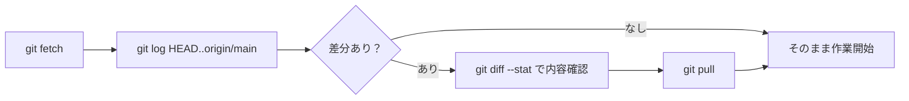
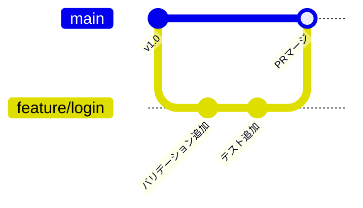
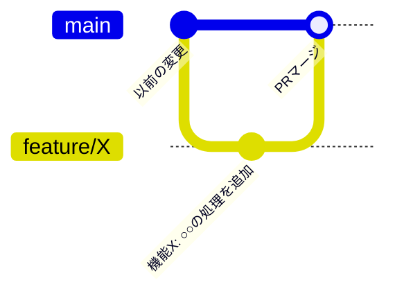
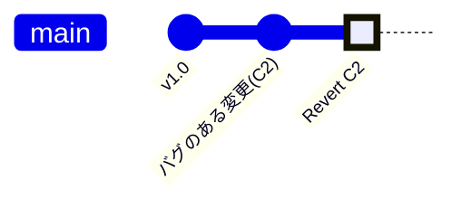
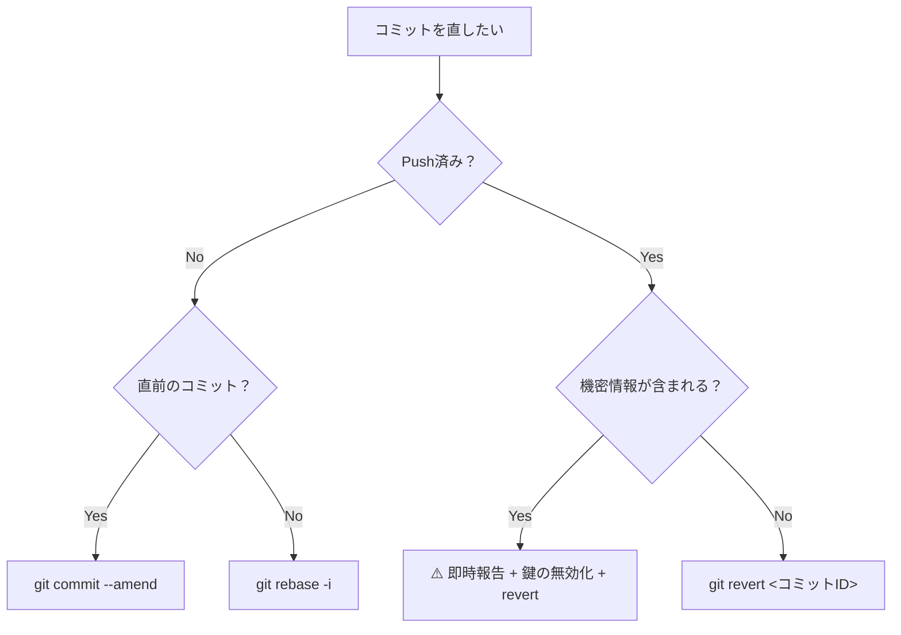

# 06. 実践シナリオ：GitHub Flow で仕事をする

これまでの章では、コマンドを1つずつ学んできました。

この章では、実際の開発現場に近い **「シナリオ（物語）形式」** で、複数のコマンドを組み合わせた流れを体験します。

コマンドを「知っている」と「使える」は違います。ここで「使える」レベルを目指しましょう。

**この章で練習するシナリオ:**

- シナリオ 1: リポジトリを clone して初期セットアップする
- シナリオ 2: 安全に最新を取り込む（fetch → 確認 → pull）
- シナリオ 3: 作業ブランチで開発して push する
- シナリオ 4: コミットを整理して Pull Request に備える（rebase -i）
- シナリオ 5: 間違ったコミットを直す（Push前 / Push後）
- シナリオ 6: 特定ファイルの変更経緯を追う（blame / show / log -p）

---

## シナリオ 1: リポジトリを手に入れる（clone）

**場面：** 新しいプロジェクトに配属された初日。「このリポジトリを使ってください」と言われた。

### 手順

**STEP 1**: リポジトリを clone する

```bash
# 書式: git clone <URL>
git clone https://github.com/チームのアカウント/プロジェクト名.git
```

clone すると、リポジトリ名のフォルダが作られます。

**STEP 2**: 中に入って状況確認

```bash
cd プロジェクト名

# どんなブランチが存在するか確認（-a でリモートブランチも表示）
git branch -a

# 最近の歴史を確認
git log --oneline --graph --all
```

`remotes/origin/main`、`remotes/origin/develop` などが表示されます。これがリモートの現状です。

**STEP 3**: 気になるブランチを手元に展開する

```bash
# develop ブランチを手元で使えるようにする
git switch develop
```

---

## シナリオ 2: 安全に最新を取り込む（fetch → 確認 → pull）

**場面：** 朝、作業を開始する前。昨晩、チームメンバーが変更を push していたかもしれない。

「いきなり pull して、知らないうちにコンフリクト...」を避けるための安全な手順です。

### 手順

**STEP 1**: リモートの最新情報だけ取得する（手元のブランチはまだ変えない）

```bash
git fetch origin
```

**STEP 2**: 「自分が持っていないコミット」を一覧する

```bash
# HEAD（自分の現在地）にない、origin/main のコミットを表示
git log HEAD..origin/main --oneline
```

何も表示されなければ差分なし。表示されれば「これから取り込まれるコミット」です。

**STEP 3**: 変更の概要を確認する

```bash
# 変更ファイルの一覧と行数の増減を確認
git diff --stat origin/main
```

**STEP 4**: 内容を確認してから pull する

```bash
git pull origin main
```



---

## シナリオ 3: 作業ブランチで開発して push する

**場面：** 「ログイン機能を追加してください」というタスクをもらった。

### 手順

**STEP 1**: 最新の main（または develop）から作業ブランチを切る

```bash
git switch main
git pull origin main

# ブランチ作成と移動を同時に（-c は create の意味）
git switch -c feature/login
```

**STEP 2**: ファイルを編集してコミットする

```bash
# ファイルを編集...

# 変更を確認
git status
git diff HEAD

# ステージング
git add login.py

# 「あ、そのファイルはまだだった」という場合は取り消し
git restore --staged login.py

# コミット
git commit -m "ログイン機能: 入力バリデーションを追加"
```

**STEP 3**: push 前に、リモートの変化を確認する

```bash
# リモートの最新を取得（手元はまだ変えない）
git fetch origin

# リモートの main と自分のブランチに差分があるか確認
git diff --stat origin/main
```

差分がある場合はリバースマージ（[05章 8節](../05_useful_tips/README.md#8-長期間の作業中に最新を取り込むリバースマージ) 参照）してから push します。

**STEP 4**: push する

```bash
# -u で「このブランチのデフォルトの push 先」を登録（初回のみ必要）
git push -u origin feature/login
```



---

## シナリオ 4: feature ブランチに squash でコミットを整理してマージする

**場面：** 機能を作っている間に、コミットが散らかってしまった。Pull Request を出す前にきれいにしたい。

### Before（散らかった状態）

```bash
git log --oneline
# h7i8j9k さらに修正
# d4e5f6g 修正
# a1b2c3d とりあえず動いた
# 9z8y7x6 機能X: 実装開始
```

### STEP 1: rebase -i でコミットを整理する

直近4件を整理します。

```bash
git rebase -i HEAD~4
```

エディタが開きます。

```text
pick 9z8y7x6 機能X: 実装開始
pick a1b2c3d とりあえず動いた
pick d4e5f6g 修正
pick h7i8j9k さらに修正
```

`pick` を以下のように書き換えて保存します：

```text
pick 9z8y7x6 機能X: 実装開始
squash a1b2c3d とりあえず動いた
squash d4e5f6g 修正
squash h7i8j9k さらに修正
```

次のメッセージ編集画面で、最終的なコミットメッセージを入力します：

```text
機能X: ○○の処理を追加
```

### After（きれいになった状態）

```bash
git log --oneline
# e1f2g3h 機能X: ○○の処理を追加
# （以前のコミット群が1つにまとまった）
```



> ⚠️ `rebase -i` は **Push 前のコミットにのみ** 行ってください。Push 後に行うと、チームの履歴との整合性が崩れます。

### 補足: 「リリース予定なし」の作業は merge --squash で保存する

検証用の仮実装や「実装したが今回のリリースから外れた機能」の内容を1コミットとして残しておく場合に使います。雑多なコミットの中身だけをまとめて、後から見返せる状態にするのが目的です。

```bash
# 例: work/verify-login-approach ブランチで検証した内容を保存する

# 保存先のブランチ（develop や別の作業用ブランチ）に移動
git switch develop

# 変更内容だけを1つにまとめて取り込む（コミットはまだされない）
git merge --squash work/verify-login-approach

# 後から読める形でコミットを作る
git commit -m "検証メモ: ログイン処理の別アプローチ（リリース対象外）"
```

| 状況 | 推奨 |
| :--- | :--- |
| 自分のフィーチャーブランチのコミットを整理したい | `rebase -i` でそのブランチ上のコミットを書き換える |
| 検証用ブランチ・リリース取りやめ機能の内容を1コミットとして保存したい | `merge --squash` で変更内容だけをまとめて別ブランチに取り込む |

---

## シナリオ 5: 間違ったコミットを直す（Push前 / Push後）

**場面：** コミットにミスがあった。どうやって直すか？

境界線は **「Push済みかどうか」** です。

### Push 前のケース

#### ケース A: コミットメッセージを間違えた

```bash
# 直前のコミットのメッセージだけ変更する
git commit --amend -m "正しいメッセージ"
```

#### ケース B: ファイルを追加し忘れた

```bash
git add 忘れたファイル.py
# メッセージはそのままで直前のコミットに追加
git commit --amend --no-edit
```

#### ケース C: 間違ったブランチにコミットした

```bash
# コミットを取り消す（ファイルの変更は残す）
git reset HEAD~1

# 正しいブランチに移動してコミットし直す
git switch 正しいブランチ
git add .
git commit -m "正しい場所にコミット"
```

#### ケース D: push 前に複数の雑なコミットを1つにまとめたい

→ **シナリオ 4**（`rebase -i`）を参照してください。

### Push 後のケース

Push 後は「歴史を書き換える」ことはできません。「打ち消すコミット」を新たに作る方法を使います。

#### ケース E: 特定のコミットを取り消したい

```bash
# コミットID を指定して、それを打ち消すコミットを作る
git revert <コミットID>

# 複数のコミットを連続して取り消す場合
git revert <古いID>..<新しいID>
```



#### ケース F: マージ済みの機能をまるごと戻したい

```bash
# -m 1 は「マージ先（main側）を正とする」という指定
git revert -m 1 <マージコミットID>
```

#### ケース G: 機密情報（パスワード等）を誤って push した

> ⚠️ **これは深刻な事態です。**

1. まずチームリーダーに即報告する
2. `git log` でそのコミットIDを確認する
3. `git revert` でコミットを打ち消す
4. push する
5. GitHub の Secret scanning アラートを確認する
6. 漏洩したキー・パスワードを **即座に無効化・再発行** する

「git から削除した」だけでは安全とは言えません。キャッシュや他のクローンに残っている可能性があります。

### 判断フロー



---

## シナリオ 6: 特定ファイルのある行の変更経緯を追う

**場面：** 担当するコードを読んでいたら、「なぜこんな書き方になっているんだ？」という行に出会った。

コミットメッセージと変更差分を追うことで、コードの **「意図」** を読み解くことができます。

### STEP 1: その行を「誰が」「いつ」書いたか調べる（blame）

```bash
# index.html の 10〜20 行目の各行にコミット情報を表示
git blame -L 10,20 index.html
```

出力例：

```text
a1b2c3d (田中太郎 2024-03-15 14:32:11 +0900 10) if (user.isAdmin) {
d4e5f6g (鈴木花子 2024-01-20 09:11:45 +0900 11)   return true;
```

**左から：** コミットID / 著者 / 日時 / 行番号 / 実際のコード

### STEP 2: そのコミットのメッセージと変更ファイル一覧を確認する（show）

```bash
# コミットメッセージと変更ファイルの一覧を表示（差分は出さない）
git show --name-only a1b2c3d
```

出力例：

```text
commit a1b2c3d...
Author: 田中太郎 <tanaka@example.com>
Date:   2024-03-15 14:32:11 +0900

    管理者チェックのロジックを追加 (#123)

index.html
auth/admin.py
tests/test_admin.py
```

コミットメッセージで「なぜ変更したか」を確認し、変更ファイル一覧で「何に影響があるか」を把握します。

### STEP 3: 関連するファイルの差分を個別に確認する

変更ファイルが複数ある場合、1ファイルずつ差分を確認します。

```bash
# 書式: git show <コミットID> -- <ファイル名>
git show a1b2c3d -- index.html
git show a1b2c3d -- auth/admin.py
```

ファイルを指定することで、そのファイルに関係する差分だけが表示され、長大な出力を読み飛ばす必要がなくなります。

### STEP 4: そのファイルの変更履歴をまとめて確認する（log -p）

```bash
# ファイル単位でコミット履歴と差分を時系列に表示
git log -p index.html

# コミット数を絞る場合（直近10件）
git log -p -10 index.html
```

### コードの「意図」を推定する

| 確認すること | 読み取れること |
| :--- | :--- |
| コミットメッセージ | 「なぜ変更したか」の意図 |
| 変更前後の差分 | 「何を直したか」の内容 |
| コミット日時 | 「いつ起きた事象への対応か」の背景 |
| 著者 | 「誰に聞けばより詳しく知れるか」 |

> **💡 blame は「犯人探し」ではなく「文脈理解」のためのツールです。** 書いた人を責めるためではなく、コードの背景を正しく理解するために使いましょう。

---

## まとめ

| シナリオ | 主なコマンド | RPGでの例え |
| :--- | :--- | :--- |
| リポジトリを手に入れる | `git clone`, `git branch -a`, `git switch` | 新しいギルドに加入して拠点のマップをダウンロードする |
| 安全に最新を取り込む | `git fetch`, `git log HEAD..origin/main`, `git diff --stat`, `git pull` | 冒険前に「仲間が昨日何を変えたか」だけ確認してから動く |
| 作業ブランチで開発して push | `git switch -c`, `git add`, `git commit`, `git push` | サブクエストのセーブデータを作り、完了したらギルドに報告する |
| コミットを整理してマージ | `git rebase -i`, `git merge --squash`, `git log --oneline` | 雑な冒険日誌を清書してから仲間に提出する |
| 間違ったコミットを直す | `git commit --amend`, `git reset`, `git revert` | 巻き戻せるなら戻す、できないなら打ち消しコミットを積む |
| 行の変更経緯を追う | `git blame -L`, `git show --name-only`, `git show -- <file>`, `git log -p` | 誰がなぜその装備を変えたか台帳と記録を追って調べる |

## 次のステップ

お疲れさまでした。全シナリオを通してコマンドの「組み合わせ方」を体験できました。

自分のPCからGitHubにアクセスするための認証設定を行いたい場合は、[99. ローカルPCでの認証設定手順](../99_reference/authentication.md) を参照してください。

---

| [← 第05章: 現場で役立つ便利機能](../05_useful_tips/README.md) | [全章目次](../README.md) | 最終章 |
|:---|:---:|---:|
